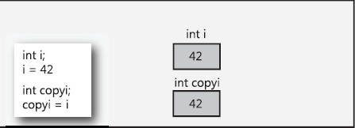
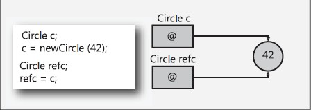

在C#中值类型的变量直接存储数据，而引用类型的变量持有的是数据的引用，数据存储在数据堆中。 

值类型（value type）：byte，short，int，long，float，double，decimal，char，bool 和 struct 统称为值类型。值类型变量声明后，不管是否已经赋值，编译器为其分配内存。  
  

引用类型（reference type）：string 和 class统称为引用类型。当声明一个类时，只在栈中分配一小片内存用于容纳一个地址，而此时并没有为其分配堆上的内存空间。当使用 new 创建一个类的实例时，分配堆上的空间，并把堆上空间的地址保存到栈上分配的小片空间中。
  
值类型的实例通常是在线程栈上分配的（静态分配），但是在某些情形下可以存储在堆中。引用类型的对象总是在进程堆中分配（动态分配）。