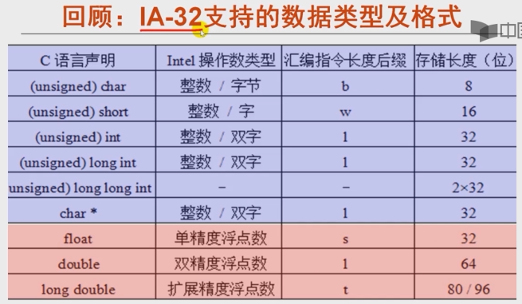
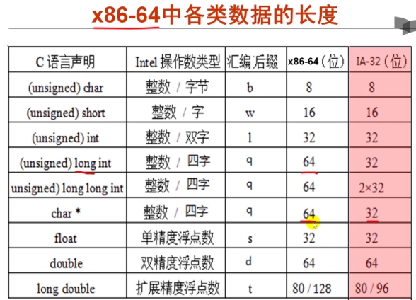
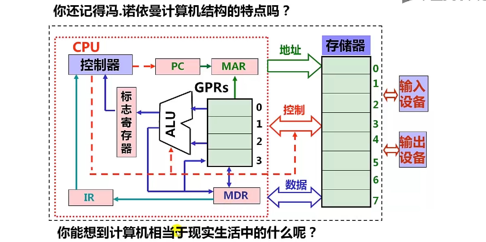
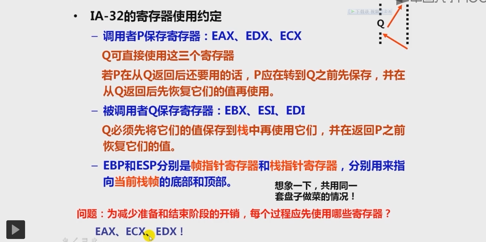
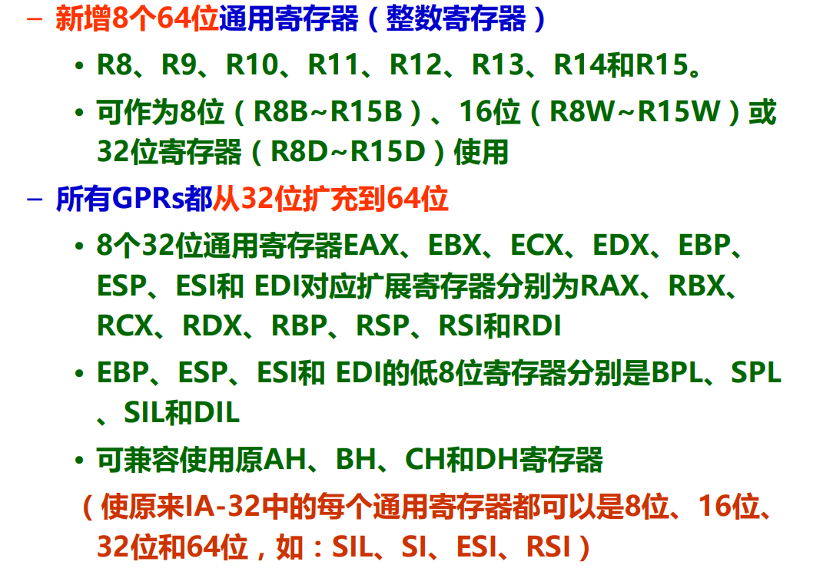

IA-32支持的数据类型和指令格式  

---
x86-64支持的数据类型和指令格式  

b->8位 byte  
w->16位 word  
l->32位 long word 
q->64位  

movesbq中sbq是把b（8位数）s（符号扩展）成q（64位）传送
z是0 扩展

---
简单CPU结构： 

---
**GPRs 通用寄存器**

不同过程寄存器的使用规定(寄存器名称)：  
  

IA-32 --> x86-64的寄存器扩展：  

x87中：（FPU指令集）  
* fldl（浮点压栈：float load long（64位））  局部变量->ST(0) 浮点寄存器的栈顶 
* fstpl（浮点弹栈：float store long）  ST(0)->参数区
在x86-64：（基于SSE的）  
浮点放在XMM寄存器中  